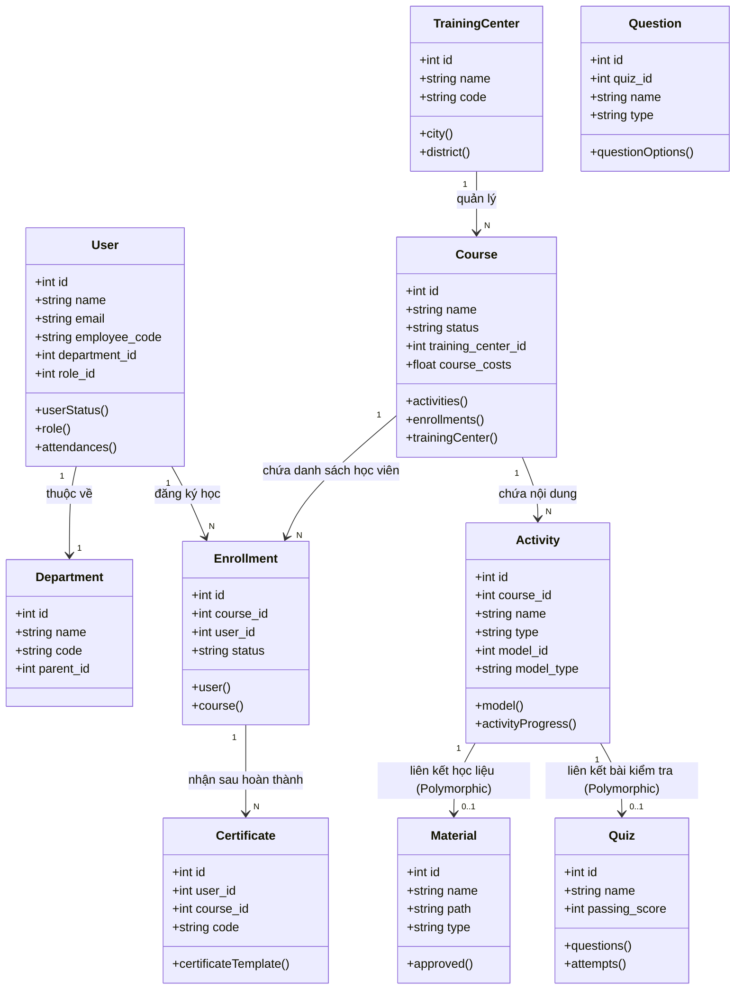
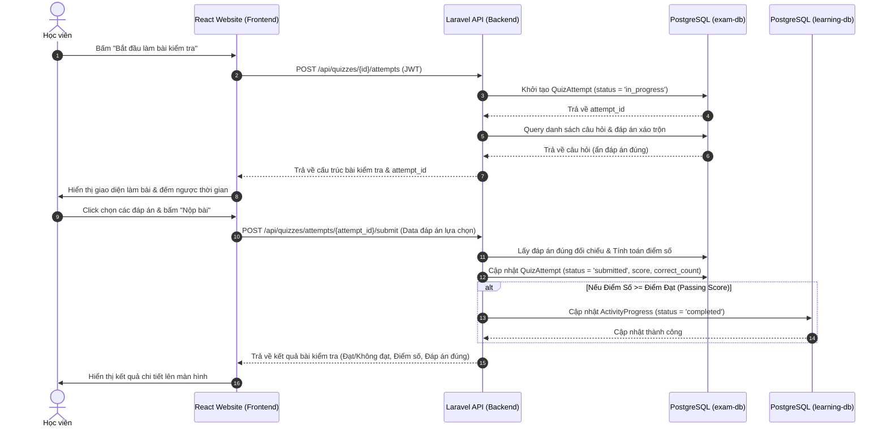
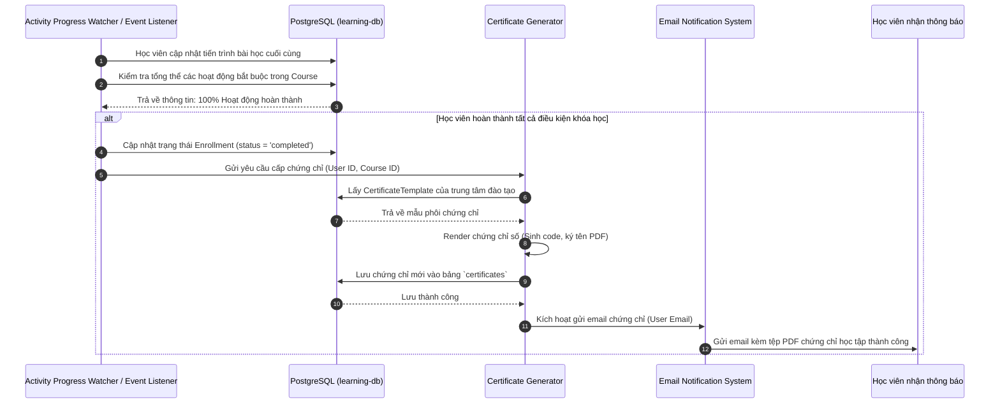
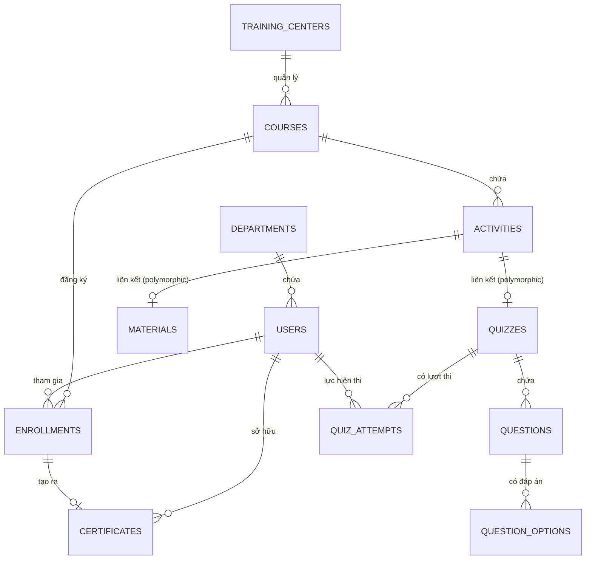

# **TẬP ĐOÀN THACO AGRI - CÔNG TY THADICO**
## **BÁO CÁO PHÂN TÍCH VÀ THIẾT KẾ HỆ THỐNG**

### **HỆ THỐNG QUẢN LÝ ĐÀO TẠO TRỰC TUYẾN E-LEARNING HUB (THACO AGRI / THADICO E-LEARNING)**

---

## **Mục lục**

* [PHẦN MỞ ĐẦU](#phần-mở-đầu)
* [CHƯƠNG 1. THU THẬP YÊU CẦU](#chương-1-thu-thập-yêu-cầu)
  * [1.1. Các yêu cầu thu thập được](#11-các-yêu-cầu-thu-thập-được)
    * [1.1.1. Yêu cầu chức năng](#111-yêu-cầu-chức-năng)
    * [1.1.2. Yêu cầu về người dùng hệ thống](#112-yêu-cầu-về-người-dùng-hệ-thống)
    * [1.1.3. Yêu cầu phi chức năng](#113-yêu-cầu-phi-chức-năng)
    * [1.1.4. Yêu cầu về dữ liệu](#114-yêu-cầu-về-dữ-liệu)
  * [1.2. Biểu đồ use case](#12-biểu-đồ-use-case)
    * [1.2.1. Biểu đồ use case tổng quát](#121-biểu-đồ-use-case-tổng-quát)
    * [1.2.2. Biểu đồ use case phân rã và Bảng mô tả chi tiết](#122-biểu-đồ-use-case-phân-rã-và-bảng-mô-tả-chi-tiết)
* [CHƯƠNG 2. PHÂN TÍCH](#chương-2-phân-tích)
  * [2.1. Các thẻ CRC](#21-các-thẻ-crc)
  * [2.2. Biểu đồ lớp](#22-biểu-đồ-lớp)
  * [2.3. Biểu đồ tuần tự](#23-biểu-đồ-tuần-tự)
  * [2.4. Phân tích dữ liệu](#24-phân-tích-dữ-liệu)
    * [2.4.1. Xác định các thực thể và thuộc tính](#241-xác-định-các-thực-thể-và-thuộc-tính)
    * [2.4.2. Mô hình thực thể và liên kết (ERD)](#242-mô-hình-thực-thể-và-liên-kết-erd)
* [CHƯƠNG 3. THIẾT KẾ HỆ THỐNG](#chương-3-thiết-kế-hệ-thống)
  * [3.1. Kiến trúc tổng quan của hệ thống](#31-kiến-trúc-tổng-quan-của-hệ-thống)
  * [3.2. Kiến trúc phần mềm](#32-kiến-trúc-phần-mềm)
  * [3.3. Thiết kế cơ sở dữ liệu](#33-thiết-kế-cơ-sở-dữ-liệu)
  * [3.4. Thiết kế giao diện](#34-thiết-kế-giao-diện)
* [CHƯƠNG 4. TRIỂN KHAI VÀ KIỂM THỬ](#chương-4-triển-khai-và-kiểm-thử)
  * [4.1. Các công nghệ sử dụng](#41-các-công-nghệ-sử-dụng)
  * [4.2. Sản phẩm phần mềm](#42-sản-phẩm-phần-mềm)
  * [4.3. Kiểm thử](#43-kiểm-thử)
* [PHẦN KẾT LUẬN](#phần-kết-luận)

---

## **PHẦN MỞ ĐẦU**

Trong xu hướng chuyển đổi số mạnh mẽ của các tập đoàn đa ngành quy mô lớn, đào tạo nội bộ đóng vai trò then chốt để duy trì và nâng cao năng lực đội ngũ nhân sự. Với quy mô hàng chục nghìn nhân viên hoạt động tại các trung tâm đào tạo, công ty thành viên của THACO AGRI và THADICO trên toàn quốc, việc quản lý đào tạo thủ công hoặc thiếu tập trung đã bộc lộ nhiều hạn chế về mặt chi phí, hiệu quả và khả năng kiểm soát chất lượng.

Hệ thống quản lý đào tạo trực tuyến **E-Learning Hub** được phát triển nhằm mục tiêu chuẩn hóa, số hóa toàn bộ hoạt động đào tạo tại THACO AGRI và THADICO. Hệ thống cung cấp giải pháp toàn diện từ quản lý học liệu, tổ chức khóa học trực tuyến (Zoom) kết hợp ngoại tuyến (Classroom), ngân hàng câu hỏi, ngân hàng đề thi, cấp chứng chỉ tự động và theo dõi chi phí đào tạo chi tiết cho từng cá nhân, phòng ban.

**Mục tiêu của hệ thống:**
1. Xây dựng nền tảng học tập trực tuyến linh hoạt, cho phép học viên truy cập nội dung học tập mọi lúc, mọi nơi.
2. Quản lý, kiểm soát quy trình phê duyệt nghiêm ngặt đối với học liệu và các khóa học trước khi xuất bản.
3. Hỗ trợ nhiều mô hình học tập kết hợp (Blended Learning): tự học qua tài liệu, học trực tuyến qua Zoom, học trực tiếp trên lớp.
4. Tự động hóa đánh giá kết quả học tập qua bài thi trực quan và cấp chứng chỉ số theo phôi mẫu của từng đơn vị đào tạo.
5. Theo dõi, tối ưu hóa ngân sách và chi phí đào tạo thực tế của doanh nghiệp.

---

## **CHƯƠNG 1. THU THẬP YÊU CẦU**

### **1.1. Các yêu cầu thu thập được**

#### **1.1.1. Yêu cầu chức năng**

Hệ thống E-Learning Hub bao gồm các nhóm chức năng cốt lõi sau:

##### **a) Quản lý cơ cấu tổ chức và người dùng (Organization Module):**
*   **Quản lý Phòng ban (Departments):** Tạo cấu trúc phân nhánh cây phòng ban (Multi-level Departments). Đồng bộ cấu trúc phòng ban từ hệ thống nhân sự tập đoàn.
*   **Quản lý Trung tâm đào tạo (Training Centers):** Quản lý thông tin chi tiết các trung tâm đào tạo trực thuộc, liên kết với địa bàn hành chính (Tỉnh/Thành phố, Quận/Huyện, Xã/Phường).
*   **Quản lý Người dùng (Users):** Quản lý hồ sơ nhân viên, mã nhân viên, chức danh công việc, phòng ban trực thuộc, trung tâm đào tạo quản lý, trạng thái hoạt động.

##### **b) Quản lý Vai trò và Phân quyền (Role & Permission Management):**
*   Hệ thống sử dụng mô hình RBAC (Role-Based Access Control) kết hợp phân quyền nâng cao cho phép:
    *   Tạo vai trò mới (Admin hệ thống, Quản lý đào tạo, Giáo viên, Học viên).
    *   Phân chi tiết quyền hạn truy cập (Xem, Thêm, Sửa, Xóa, Phê duyệt) đối với từng phân hệ: Khóa học, Học liệu, Đề thi, Chứng chỉ.

##### **c) Quản lý Học liệu (Material Management):**
*   **Đăng tải học liệu:** Hỗ trợ nhiều định dạng tài liệu (PDF, Video, Slide bài giảng trực tiếp).
*   **Quy trình phê duyệt học liệu:** Trạng thái học liệu được kiểm soát chặt chẽ (Nháp -> Chờ phê duyệt -> Đã duyệt/Hoạt động -> Hết hiệu lực). Cho phép khôi phục học liệu hoặc thiết lập hết hạn dùng.

##### **d) Ngân hàng câu hỏi và Đề thi (Question & Exam Bank):**
*   **Ngân hàng câu hỏi:** Quản lý danh mục câu hỏi theo chuyên ngành, chuyên đề, mức độ khó/dễ. Hỗ trợ câu hỏi trắc nghiệm một lựa chọn, nhiều lựa chọn, tự luận, câu hỏi cha-con (mixed questions).
*   **Ngân hàng đề thi (Quizzes):** Thiết lập cấu trúc đề thi, số lượng câu hỏi, thời gian làm bài, điểm đạt (passing score). Hỗ trợ nhân bản đề thi để tái sử dụng.

##### **e) Quản lý Khóa học (Course Management):**
*   **Thiết lập khóa học:** Tạo khóa học mới, cấu hình hình thức học (Trực tuyến, Trực tiếp, Tự học hoặc Kết hợp), thiết lập điều kiện học theo thứ tự nội dung.
*   **Quản lý nội dung học tập (Activities):** Cấu trúc khóa học chia thành các nhóm bài học (Session). Mỗi bài học chứa các hoạt động học tập đa dạng (Material - Học liệu, Classroom - Lịch học trực tiếp, Zoom - Học trực tuyến, Test - Bài kiểm tra).
*   **Phê duyệt khóa học:** Quy trình duyệt khóa học trước khi công khai cho học viên đăng ký hoặc chỉ định bắt buộc tham gia.
*   **Nhân bản khóa học:** Sao chép cấu trúc khóa học cũ sang khóa học mới nhanh chóng.

##### **f) Học tập và Theo dõi tiến trình (Student Portal):**
*   **Trình phát nội dung học tập (Course Player):** Giao diện học tập tối ưu hỗ trợ học viên xem tài liệu PDF trực tiếp, xem video, tham gia lớp học Zoom trực tiếp và làm bài thi kiểm tra ngay trên hệ thống.
*   **Theo dõi tiến độ học tập (Progress Tracking):** Tự động ghi nhận thời gian học tập, trạng thái hoàn thành từng hoạt động của học viên để tổng hợp tiến độ khóa học (% Course Completion).

##### **g) Quản lý Phôi và Cấp chứng chỉ (Certificate Management):**
*   **Quản lý phôi chứng chỉ (Templates):** Thiết kế mẫu chứng chỉ trực quan, định dạng nền, cấu hình chữ chữ ký hiển thị và căn chỉnh thông tin tự động trên phôi chứng chỉ.
*   **Cấp chứng chỉ:** Tự động phát hành chứng chỉ số khi học viên hoàn thành khóa học đạt chuẩn. Hỗ trợ import/upload chứng chỉ ngoài nếu đào tạo từ đơn vị liên kết.

##### **h) Thiết lập và Theo dõi Chi phí (Cost Setup):**
*   Thiết lập chi phí cụ thể cho từng khóa học bao gồm: Chi phí đứng lớp của giảng viên, chi phí học liệu, chi phí cam kết đào tạo đối với từng học viên khi tham gia học tập.

##### **i) Thông báo và Tiện ích (Utility Module):**
*   Hệ thống tự động gửi email thông báo khi có khóa học mới được phê duyệt, nhắc nhở tham gia lớp học trực tuyến Zoom, hoặc khi hoàn thành khóa học và được cấp chứng chỉ. Quản lý chữ ký số email.

---

#### **1.1.2. Yêu cầu về người dùng hệ thống**

Hệ thống phục vụ 3 nhóm đối tượng người dùng chính với nhu cầu tương tác khác nhau:

| **Tác nhân (Actor)** | **Mô tả** | **Chức năng chính** |
| :--- | :--- | :--- |
| **Admin hệ thống** | Quản trị viên kỹ thuật toàn hệ thống | Quản lý người dùng, phân quyền nhóm vai trò, đồng bộ phòng ban, thiết lập cấu hình hệ thống, quản lý cơ sở dữ liệu. |
| **Quản lý Đào tạo / Giáo viên** | Nhân sự phòng nhân sự/đào tạo của doanh nghiệp | Đăng tải học liệu, soạn thảo câu hỏi/đề thi, thiết lập khóa học, duyệt học viên, theo dõi chi phí, phê duyệt tài liệu, chấm thi tự luận. |
| **Học viên (Nhân viên)** | Cán bộ nhân viên tập đoàn cần tham gia đào tạo | Đăng ký khóa học, xem tài liệu bài học, tham gia lớp học trực tuyến qua Zoom, điểm danh lớp offline, làm bài thi kiểm tra, nhận chứng chỉ số. |

---

#### **1.1.3. Yêu cầu phi chức năng**

*   **Kiến trúc Đa cơ sở dữ liệu (Multi-Database):** Để đáp ứng tải dữ liệu lớn và phân tách nghiệp vụ rõ ràng, hệ thống được cấu hình phân tán trên 4 cơ sở dữ liệu PostgreSQL độc lập:
    *   `organization-db`: Lưu trữ thông tin nhân sự, phòng ban, phân quyền Spatie.
    *   `learning-db`: Lưu trữ cấu trúc khóa học, học liệu, hoạt động giảng dạy, chứng chỉ.
    *   `exam-db`: Lưu trữ ngân hàng câu hỏi, đề thi và lịch sử làm bài thi.
    *   `utility-db`: Lưu trữ file tải lên, thông báo, nhật ký hành động (action logs), email.
*   **Bảo mật hệ thống:** Xác thực và phân quyền API bằng cơ chế JWT token (Laravel Sanctum). Tất cả mật khẩu người dùng phải được mã hóa bằng chuẩn Argon2 hoặc BCrypt.
*   **Hiệu năng xử lý:** Thời gian phản hồi API trung bình dưới 300ms. Sử dụng cơ chế SWR (Stale-While-Revalidate) phía Frontend để lưu trữ đệm dữ liệu tạm thời, hạn chế truy vấn API trùng lặp lên máy chủ.
*   **Khả dụng và Tương thích:** Hệ thống thiết kế responsive hoạt động tốt trên cả trình duyệt Desktop và thiết bị di động (Mobile Web).
*   **Đồng bộ dữ liệu:** Khả năng đồng bộ hóa không đồng bộ (Asynchronous Sync) dữ liệu nhân sự và phòng ban từ hệ thống tổng của THACO AGRI mà không làm gián đoạn trải nghiệm người dùng.

---

#### **1.1.4. Yêu cầu về dữ liệu**

*   **Tính toàn vẹn dữ liệu:** Tất cả các thực thể nghiệp vụ phải thừa kế cơ chế lưu trữ Audit trail (ghi nhận thời điểm tạo, chỉnh sửa và người thực hiện tác vụ).
*   **Xóa mềm (Soft Delete):** Đảm bảo an toàn thông tin, không xóa trực tiếp bản ghi khỏi DB vật lý khi người dùng thực hiện thao tác "Xóa" trên giao diện (sử dụng thuộc tính `deleted_at`).
*   **Quản lý tệp tin tập trung:** Hỗ trợ lưu trữ đa phương tiện (PDF, MP4, JPEG) thông qua hệ thống lưu trữ tập trung (MinIO hoặc S3), thông tin tệp tin được quản lý tại bảng `files` của DB Utility.

---

### **1.2. Biểu đồ use case**

#### **1.2.1. Biểu đồ use case tổng quát**

Dưới đây là biểu đồ Use Case tổng quát thể hiện mối liên hệ giữa các tác nhân chính và các phân hệ chức năng cốt lõi của hệ thống E-Learning Hub:

```mermaid
usecaseDiagram
    actor "Admin Hệ thống" as admin
    actor "Quản lý Đào tạo / Giáo viên" as manager
    actor "Học viên (Nhân viên)" as student

    rectangle "Hệ thống E-Learning Hub" {
        usecase "Đăng nhập hệ thống (JWT)" as UC01
        usecase "Quản lý Phòng ban & Người dùng" as UC02
        usecase "Phân quyền & Vai trò" as UC03
        usecase "Quản lý Học liệu & Phê duyệt" as UC04
        usecase "Quản lý Ngân hàng đề thi" as UC05
        usecase "Thiết lập & Phê duyệt khóa học" as UC06
        usecase "Tham gia học tập & Tương tác" as UC07
        usecase "Làm bài thi kiểm tra" as UC08
        usecase "Quản lý Phôi & Cấp chứng chỉ" as UC09
        usecase "Thiết lập Chi phí đào tạo" as UC10
        usecase "Xem báo cáo & Thống kê tiến độ" as UC11
    }

    admin --> UC01
    admin --> UC02
    admin --> UC03
    admin --> UC11

    manager --> UC01
    manager --> UC04
    manager --> UC05
    manager --> UC06
    manager --> UC09
    manager --> UC10
    manager --> UC11

    student --> UC01
    student --> UC07
    student --> UC08
    student --> UC09
```

---

#### **1.2.2. Biểu đồ use case phân rã và Bảng mô tả chi tiết**

##### **a) Biểu đồ Use Case phân rã phân hệ Khóa học và Học tập:**

```mermaid
usecaseDiagram
    actor "Quản lý Đào tạo" as manager
    actor "Học viên" as student

    rectangle "Phân rã chức năng học tập & khóa học" {
        usecase "Tạo khóa học mới" as UC_C1
        usecase "Thêm hoạt động học tập (Zoom/Material/Classroom)" as UC_C2
        usecase "Thiết lập chi phí cam kết" as UC_C3
        usecase "Gửi yêu cầu phê duyệt khóa học" as UC_C4
        usecase "Học tập nội dung (Xem PDF/Video)" as UC_L1
        usecase "Tham gia lớp học Zoom trực tuyến" as UC_L2
        usecase "Thực hiện làm bài kiểm tra đạt chuẩn" as UC_L3
        usecase "Tự động phát hành chứng chỉ" as UC_L4
    }

    manager --> UC_C1
    manager --> UC_C2
    manager --> UC_C3
    manager --> UC_C4

    student --> UC_L1
    student --> UC_L2
    student --> UC_L3
    student --> UC_L4

    UC_L4 ..> UC_L3 : <<include>>
```

##### **b) Các bảng mô tả Use Case chi tiết:**

###### **Bảng mô tả Use Case — UC01: Đăng nhập hệ thống (Sanctum/JWT)**
| **Thuộc tính** | **Nội dung** |
| :--- | :--- |
| **Tên Use Case** | UC01 — Đăng nhập hệ thống |
| **Tác nhân** | Admin hệ thống, Quản lý đào tạo, Giáo viên, Học viên |
| **Mô tả** | Người dùng sử dụng tài khoản doanh nghiệp đăng nhập để truy cập hệ thống học tập. |
| **Điều kiện tiên quyết** | Tài khoản nhân sự đã được đồng bộ và kích hoạt trên hệ thống. |
| **Luồng chính** | 1. Người dùng truy cập giao diện đăng nhập.<br>2. Nhập Email/Tên đăng nhập và mật khẩu.<br>3. Nhấn "Đăng nhập".<br>4. Hệ thống gọi API xác thực, sinh JWT token cá nhân lưu vào Cookie/Local Storage.<br>5. Điều hướng người dùng vào Dashboard tương ứng với vai trò (Layout Admin hoặc Layout Học viên). |
| **Luồng thay thế** | 3a. Nhập sai mật khẩu -> Hệ thống thông báo lỗi xác thực tài khoản.<br>3b. Tài khoản chưa được kích hoạt -> Thông báo liên hệ quản trị viên.<br>3c. Đồng bộ Keycloak thất bại -> Hệ thống cho phép đăng nhập qua API nội bộ Sanctum. |
| **Kết quả** | Đăng nhập thành công, thiết lập session làm việc với JWT hợp lệ. |

###### **Bảng mô tả Use Case — UC02: Đăng tải và Duyệt học liệu**
| **Thuộc tính** | **Nội dung** |
| :--- | :--- |
| **Tên Use Case** | UC02 — Đăng tải và Duyệt học liệu |
| **Tác nhân** | Quản lý Đào tạo, Giáo viên |
| **Mô tả** | Đăng tải tài liệu học tập lên kho lưu trữ và thực hiện phê duyệt để sử dụng trong các bài học. |
| **Điều kiện tiên quyết** | Người dùng đăng nhập với quyền "Quản lý học liệu". |
| **Luồng chính** | 1. Chọn chức năng "Quản lý học liệu" -> "Thêm mới".<br>2. Nhập tên tài liệu, mã học liệu, loại (PDF, Video) và tải tệp tin lên hệ thống.<br>3. Lưu trạng thái nháp (Draft).<br>4. Quản lý Đào tạo tiến hành duyệt học liệu (Approve) chuyển trạng thái sang Hoạt động (Active). |
| **Luồng thay thế** | 2a. Định dạng tệp tin không hợp lệ -> Hệ thống từ chối tải lên và hiển thị cảnh báo.<br>4a. Từ chối duyệt học liệu -> Trạng thái chuyển thành "Từ chối" kèm lý do. |
| **Kết quả** | Học liệu được xuất bản thành công, sẵn sàng liên kết vào các khóa học. |

###### **Bảng mô tả Use Case — UC03: Tạo và thiết lập khóa học**
| **Thuộc tính** | **Nội dung** |
| :--- | :--- |
| **Tên Use Case** | UC03 — Thiết lập khóa học trực tuyến |
| **Tác nhân** | Quản lý Đào tạo, Giáo viên |
| **Mô tả** | Thiết lập cấu trúc khóa học bao gồm chi phí đào tạo và lịch học chi tiết cho từng đối tượng học viên. |
| **Điều kiện tiên quyết** | Đăng nhập hệ thống với vai trò quản trị/đào tạo. Học liệu đã được phê duyệt sẵn. |
| **Luồng chính** | 1. Chọn "Quản lý khóa học" -> "Thêm khóa học".<br>2. Nhập thông tin cơ bản: Tên, thời gian bắt đầu/kết thúc, hình thức học, trung tâm đào tạo quản lý.<br>3. Thiết lập chi phí đào tạo: Chi phí đứng lớp, chi phí học liệu, cam kết thời gian.<br>4. Tạo các Session và kéo thả các hoạt động học tập (Material, Lịch Zoom, Bài thi) vào session.<br>5. Bấm "Lưu" và gửi yêu cầu phê duyệt khóa học. |
| **Luồng thay thế** | 4a. Chưa cấu hình bài thi đạt chuẩn -> Cảnh báo yêu cầu bổ sung bài thi trước khi xuất bản. |
| **Kết quả** | Khóa học được tạo ở trạng thái Chờ duyệt. |

###### **Bảng mô tả Use Case — UC04: Học tập và làm bài kiểm tra**
| **Thuộc tính** | **Nội dung** |
| :--- | :--- |
| **Tên Use Case** | UC04 — Học tập và làm bài kiểm tra |
| **Tác nhân** | Học viên (Nhân viên) |
| **Mô tả** | Học viên tiến hành xem nội dung bài học trong trình phát và hoàn thành bài thi trắc nghiệm đánh giá. |
| **Điều kiện tiên quyết** | Học viên đã được ghi danh (Enrollment) vào khóa học. |
| **Luồng chính** | 1. Học viên vào "Khóa học của tôi" -> chọn khóa học đang diễn ra.<br>2. Nhấp vào các hoạt động (Xem tài liệu PDF hoặc xem video). Hệ thống ghi nhận tiến trình học tập.<br>3. Nhấp vào bài kiểm tra (Test/Examination) -> "Bắt đầu làm bài".<br>4. Trả lời các câu hỏi trắc nghiệm trong thời gian đếm ngược.<br>5. Nhấn "Nộp bài". Hệ thống chấm điểm tự động dựa trên đáp án ngân hàng câu hỏi.<br>6. Hiển thị kết quả đạt/không đạt ngay lập tức. |
| **Luồng thay thế** | 4a. Hết thời gian làm bài -> Hệ thống tự động nộp bài thi của học viên.<br>5a. Bài thi có câu hỏi tự luận -> Trạng thái bài thi là "Chờ chấm điểm" cho đến khi giáo viên chấm bài. |
| **Kết quả** | Hệ thống lưu kết quả thi (Score, Correct Count) vào bảng `quiz_attempts`. |

---

## **CHƯƠNG 2. PHÂN TÍCH**

### **2.1. Các thẻ CRC**

Các lớp nghiệp vụ then chốt trong hệ thống được định nghĩa qua các thẻ CRC sau:

| **Lớp (Class)** | **Trách nhiệm (Responsibilities)** | **Cộng tác (Collaborators)** |
| :--- | :--- | :--- |
| **User** | *   Lưu trữ thông tin nhân viên, email, mã nhân viên.<br>*   Xác thực truy cập và liên kết vai trò của hệ thống.<br>*   Liên kết với phòng ban và trung tâm đào tạo. | Department, Role, Enrollment, QuizAttempt |
| **Department** | *   Quản lý cấu trúc phân cấp cây phòng ban tập đoàn.<br>*   Phân nhóm nhân viên theo bộ phận làm việc. | User |
| **TrainingCenter** | *   Quản lý thông tin trung tâm đào tạo trực thuộc.<br>*   Quản lý khóa học thuộc trung tâm phụ trách. | Course, User |
| **Course** | *   Quản lý thông tin chung khóa học (Thời gian bắt đầu, kết thúc, chi phí).<br>*   Liên kết các hoạt động học tập.<br>*   Quản lý học viên đăng ký tham gia. | Activity, Enrollment, TrainingCenter |
| **Activity** | *   Đại diện cho một hoạt động học tập (Slide, Zoom, Lịch học, Bài thi).<br>*   Quản lý vị trí bài học hiển thị cho học viên.<br>*   Theo dõi tiến độ hoàn thành hoạt động. | Course, Material, Quiz, ActivityProgress |
| **Enrollment** | *   Lưu trữ thông tin học viên được phân bổ vào khóa học.<br>*   Ghi nhận tiến độ tổng quát khóa học.<br>*   Quản lý trạng thái học tập (Đang học, Hoàn thành, Không đạt). | Course, User |
| **Quiz** | *   Thiết lập cấu trúc đề thi thử và đề thi chính thức.<br>*   Quản lý thời gian, số lượng câu hỏi và điểm đạt chuẩn. | Question, QuizAttempt, Activity |
| **Question** | *   Lưu trữ nội dung câu hỏi, độ khó, điểm số.<br>*   Quản lý danh sách các đáp án lựa chọn tương ứng. | Quiz, QuestionOption |
| **Certificate** | *   Lưu trữ chứng chỉ số được cấp cho học viên.<br>*   Liên kết với phôi chứng chỉ hiển thị tương ứng. | User, Course, CertificateTemplate |

---

### **2.2. Biểu đồ lớp**

Biểu đồ lớp dưới đây thể hiện cấu trúc tĩnh và mối liên kết logic giữa các Model Laravel thuộc các database khác nhau (`organization`, `learning`, `exam`):



---

### **2.3. Biểu đồ tuần tự**

#### **Luồng 1: Tiến trình học viên làm bài kiểm tra trắc nghiệm (Quiz Taking)**

Biểu đồ tuần tự dưới đây thể hiện sự tương tác giữa trình duyệt Client (React FE), Hệ thống API Backend (Laravel), và các Cơ sở dữ liệu phân tán khi học viên thực hiện làm bài kiểm tra:



#### **Luồng 2: Cấp chứng chỉ tự động sau khi hoàn thành khóa học (Certificate Auto-Issuance)**

Khi học viên hoàn thành hoạt động học tập cuối cùng trong khóa học, hệ thống tự động kiểm tra tiến độ và phát hành chứng chỉ:



---

### **2.4. Phân tích dữ liệu**

#### **2.4.1. Xác định các thực thể và thuộc tính**

Hệ thống được thiết kế dựa trên các thực thể dữ liệu phân bổ trên các DB chuyên biệt:

| **Bảng dữ liệu** | **Thuộc tính chính** | **Kiểu dữ liệu** | **Mô tả** |
| :--- | :--- | :--- | :--- |
| **`users`** | `id`<br>`name`<br>`email`<br>`employee_code`<br>`password`<br>`department_id`<br>`status`<br>`gender`<br>`job_title` | BIGINT (PK)<br>VARCHAR<br>VARCHAR<br>VARCHAR<br>VARCHAR<br>INT (FK)<br>VARCHAR<br>VARCHAR<br>VARCHAR | Lưu giữ hồ sơ nhân viên trong hệ thống (DB Organization). |
| **`departments`** | `id`<br>`name`<br>`code`<br>`parent_id` | INT (PK)<br>VARCHAR<br>VARCHAR<br>INT | Sơ đồ hình cây quản lý phòng ban doanh nghiệp (DB Organization). |
| **`training_centers`** | `id`<br>`name`<br>`code`<br>`description` | INT (PK)<br>VARCHAR<br>VARCHAR<br>TEXT | Các trung tâm tổ chức đào tạo nội bộ (DB Organization). |
| **`courses`** | `id`<br>`name`<br>`status`<br>`form_of_learning`<br>`start`<br>`end`<br>`training_center_id`<br>`course_costs` | BIGINT (PK)<br>VARCHAR<br>VARCHAR<br>TIMESTAMP<br>TIMESTAMP<br>INT (FK)<br>FLOAT | Lưu trữ thực thể Khóa học, chi phí (DB Learning). |
| **`activities`** | `id`<br>`course_id`<br>`name`<br>`type`<br>`model_id`<br>`model_type`<br>`position` | BIGINT (PK)<br>BIGINT (FK)<br>VARCHAR<br>VARCHAR<br>BIGINT<br>VARCHAR<br>INT | Hoạt động cụ thể trong khóa học, liên kết đa hình (DB Learning). |
| **`enrollments`** | `id`<br>`course_id`<br>`user_id`<br>`status`<br>`progress` | BIGINT (PK)<br>BIGINT (FK)<br>BIGINT (FK)<br>VARCHAR<br>INT | Quản lý mối quan hệ học viên - khóa học, theo dõi % tiến độ (DB Learning). |
| **`certificates`** | `id`<br>`user_id`<br>`course_id`<br>`code`<br>`certificate_template_id` | BIGINT (PK)<br>BIGINT (FK)<br>BIGINT (FK)<br>VARCHAR<br>BIGINT (FK) | Chứng chỉ số cấp phát cho học viên (DB Learning). |
| **`quizzes`** | `id`<br>`name`<br>`code`<br>`passing_score`<br>`duration` | BIGINT (PK)<br>VARCHAR<br>VARCHAR<br>INT<br>INT | Đề thi trắc nghiệm (DB Exam). |
| **`questions`** | `id`<br>`quiz_id`<br>`name`<br>`type`<br>`score` | BIGINT (PK)<br>BIGINT (FK)<br>TEXT<br>VARCHAR<br>FLOAT | Câu hỏi thi trắc nghiệm hoặc tự luận (DB Exam). |
| **`quiz_attempts`** | `id`<br>`quiz_id`<br>`user_id`<br>`score`<br>`status` | BIGINT (PK)<br>BIGINT (FK)<br>BIGINT (FK)<br>FLOAT<br>VARCHAR | Lưu vết lượt thi, điểm số đạt được của nhân viên (DB Exam). |
| **`files`** | `id`<br>`name`<br>`path`<br>`mime_type`<br>`size` | BIGINT (PK)<br>VARCHAR<br>VARCHAR<br>VARCHAR<br>BIGINT | File tải lên tập trung (PDF, Slide, MP4) (DB Utility). |

---

#### **2.4.2. Mô hình thực thể và liên kết (ERD)**



---

## **CHƯƠNG 3. THIẾT KẾ HỆ THỐNG**

### **3.1. Kiến trúc tổng quan của hệ thống**

Hệ thống được thiết kế theo mô hình Client-Server 3 tầng chuẩn dịch vụ Web doanh nghiệp hiện đại:

1.  **Tầng Presentation (Giao diện hiển thị):**
    *   Xây dựng bằng **ReactJS** sử dụng thư viện quản lý UI cao cấp, cho giao diện responsive trên mọi thiết bị. Giao tiếp hoàn toàn phi trạng thái (Stateless) với máy chủ qua RESTful API, truyền tải dữ liệu định dạng JSON.
2.  **Tầng Application (Xử lý nghiệp vụ):**
    *   **Laravel API Gateway:** Đóng vai trò tiếp nhận, xác thực bảo mật JWT, phân phối luồng công việc đến các Module nghiệp vụ.
    *   Hệ thống chia thành 5 Module độc lập: `Learning`, `Exam`, `Organization`, `Utility`, `Report` giúp tối ưu hóa cấu trúc mã nguồn, dễ dàng nâng cấp hoặc tách thành kiến trúc vi dịch vụ (Microservices) trong tương lai.
3.  **Tầng Data (Lưu trữ và Truy xuất):**
    *   **PostgreSQL Cluster:** Tổ chức dữ liệu phân tán trên 4 cơ sở dữ liệu chuyên biệt. Laravel sử dụng Dynamic Database Connections để điều phối ghi/đọc dữ liệu chính xác theo Module.

---

### **3.2. Kiến trúc phần mềm**

#### **a) Cấu trúc thư mục Backend (Laravel Modules):**
Mã nguồn Backend tổ chức theo mô hình Modular Domain để quản lý hiệu quả các phân hệ nghiệp vụ:
```text
thaco-agri-e-learning-hub-api/
├── Modules/
│   ├── Organization/        # Quản lý Users, Roles, Departments, Training Centers
│   │   ├── Database/Migrations/
│   │   ├── Models/          # User.php, Department.php, Role.php
│   │   ├── Services/        # AuthService.php, UserService.php
│   │   └── Http/Controllers/# AuthController.php
│   ├── Learning/            # Quản lý khóa học, tài liệu, hoạt động học tập, chứng chỉ
│   │   ├── Database/Migrations/
│   │   ├── Models/          # Course.php, Activity.php, Material.php, Certificate.php
│   │   └── Services/        # CourseService.php, ProgressService.php
│   ├── Exam/                # Quản lý ngân hàng câu hỏi, đề thi trắc nghiệm và kết quả thi
│   │   ├── Models/          # Quiz.php, Question.php, QuizAttempt.php
│   │   └── Services/        # QuizService.php, QuestionService.php
│   ├── Utility/             # Quản lý Files, Gửi Email, Sms, Notifications
│   │   └── Models/          # File.php, Notification.php, Email.php
│   └── Report/              # Thống kê, xuất excel dữ liệu học tập
```

#### **b) Cấu trúc thư mục Frontend (ReactJS):**
Frontend tổ chức theo kiến trúc tính năng (Feature-based) rõ ràng và có thể tái sử dụng:
```text
thadico-e-learning-hub-website/
├── src/
│   ├── core/                # Các xử lý lõi (Certificates, Auth API)
│   ├── features/            # Logic nghiệp vụ độc lập (auth, learning, file-upload)
│   ├── sections/            # Giao diện trang chính (course, home, user, systems)
│   │   ├── course/          # Trang danh sách khóa học, Trình phát học tập (player)
│   │   ├── home/            # Dashboard thống kê
│   │   └── systems/         # Giao diện cấu hình phân quyền hệ thống
│   ├── shared/              # Custom Hooks chung, Axios client setup, SWR configurations
│   └── routes/              # Định tuyến trang ứng dụng (paths.ts)
```

---

### **3.3. Thiết kế cơ sở dữ liệu**

Do hệ thống sử dụng kiến trúc Đa cơ sở dữ liệu (Multi-Database), file cấu hình kết nối database trong Laravel được thiết lập liên kết động đến các schema tương ứng của PostgreSQL:

```php
// config/database.php
return [
    'connections' => [
        'organization-db' => [
            'driver' => 'pgsql',
            'host' => env('DB_ORGANIZATION_HOST', '127.0.0.1'),
            'database' => env('DB_ORGANIZATION_DATABASE', 'e_learning_organization'),
            // ... credentials
        ],
        'learning-db' => [
            'driver' => 'pgsql',
            'host' => env('DB_LEARNING_HOST', '127.0.0.1'),
            'database' => env('DB_LEARNING_DATABASE', 'e_learning_learning'),
            // ... credentials
        ],
        'exam-db' => [
            'driver' => 'pgsql',
            'host' => env('DB_EXAM_HOST', '127.0.0.1'),
            'database' => env('DB_EXAM_DATABASE', 'e_learning_exam'),
            // ... credentials
        ],
        'utility-db' => [
            'driver' => 'pgsql',
            'host' => env('DB_UTILITY_HOST', '127.0.0.1'),
            'database' => env('DB_UTILITY_DATABASE', 'e_learning_utility'),
            // ... credentials
        ],
    ]
];
```

Mỗi Model kế thừa liên kết tương ứng bằng thuộc tính `$connection`, ví dụ:
```php
class Course extends Model {
    protected $connection = 'learning-db';
    protected $table = 'courses';
}
```

---

### **3.4. Thiết kế giao diện**

Hệ thống được thiết kế với các phân hệ giao diện chi tiết:

1.  **Giao diện Đăng nhập (Authentication Layout):**
    *   Form tối giản, bảo mật 2 lớp qua email/OTP nếu tài khoản kích hoạt bảo mật cao. Giao diện thiết kế theo nhận diện thương hiệu với tone màu chủ đạo của THACO/THADICO (Xanh lá & Xanh dương nhạt).
2.  **Giao diện Dashboard (Home Dashboard):**
    *   **Đối với học viên:** Hiển thị danh sách khóa học cần hoàn thành gấp, thống kê số giờ học, và bảng tin thông báo cập nhật lớp học Zoom.
    *   **Đối với Quản lý:** Biểu đồ thống kê tỷ lệ hoàn thành khóa học, biểu đồ tròn phân tích chất lượng thi, tổng ngân sách đào tạo đã phân bổ.
3.  **Trình phát học tập thông minh (Course Player):**
    *   Thanh bên trái hiển thị cây danh mục Session và các hoạt động. Giao diện chính hiển thị nội dung: Trình đọc tài liệu PDF trực tiếp, xem video chất lượng cao tích hợp ghi nhận tiến trình, nút bấm tham gia phòng Zoom trực tiếp, hoặc khung làm bài thi tính giờ.
4.  **Trang Quản lý người dùng và Phân quyền (System Control Panel):**
    *   Bảng phân quyền chi tiết, quản trị viên dễ dàng tích chọn bật/tắt các quyền cụ thể của nhóm vai trò Spatie.

---

## **CHƯƠNG 4. TRIỂN KHAI VÀ KIỂM THỬ**

### **4.1. Các công nghệ sử dụng**

Hệ thống E-Learning Hub được triển khai bằng các giải pháp công nghệ sau:

| **Nhóm** | **Công nghệ** | **Phiên bản / Mô tả** |
| :--- | :--- | :--- |
| **Backend** | PHP | Phiên bản 8.2 — Tối ưu hóa xử lý bộ nhớ, hỗ trợ kiểu dữ liệu nghiêm ngặt. |
| | Laravel Framework | Phiên bản 10.x — Sử dụng Laravel Modules quản trị domain. |
| | Laravel Sanctum | Xác thực JWT Token không trạng thái hiệu năng cao. |
| | Spatie Permissions | Gói thư viện phân quyền người dùng nâng cao. |
| **Database** | PostgreSQL | Hệ quản trị cơ sở dữ liệu quan hệ mạnh mẽ, lưu trữ JSON hiệu quả. |
| **Frontend** | ReactJS | Phiên bản 18 — SPA mượt mà, cấu trúc Feature-based, Axios client. |
| | SWR | Thư viện quản lý bộ nhớ đệm dữ liệu đầu cuối (Data Caching). |
| **DevOps** | Docker & Docker Compose | Container hóa toàn bộ hạ tầng Backend, Frontend, Postgres. |

---

### **4.2. Sản phẩm phần mềm**

Hệ thống đã triển khai hoàn thiện các cấu phần:

*   **API Service:** Hoàn tất hệ thống RESTful API chuẩn hóa, trả về cấu trúc JSON đồng nhất, xử lý ngoại lệ tự động, log lỗi chi tiết tại DB Utility.
*   **Web Portal:** Trang Web học tập hoàn chỉnh tích hợp xem tài liệu học tập, xem bài giảng, kiểm tra trực tuyến, xem lịch học tập cá nhân, nhận thông báo và tải chứng chỉ.
*   **Admin Panel:** Giao diện trực quan dành cho Quản lý đào tạo để cấu hình chi phí khóa học, đăng tài liệu, duyệt khóa học, quản lý đề thi và chấm điểm.

---

### **4.3. Kiểm thử**

Hệ thống được trải qua quá trình kiểm thử nghiêm ngặt bao gồm:

1.  **Kiểm thử đơn vị (Unit Testing):**
    *   Viết test case kiểm thử logic tính toán phần trăm hoàn thành khóa học dựa trên trạng thái học tập của từng hoạt động.
    *   Kiểm tra logic chấm điểm tự động đối với các đề thi có nhiều kiểu câu hỏi đan xen (Trắc nghiệm, đúng/sai, tự luận).
2.  **Kiểm thử tích hợp (Integration Testing):**
    *   Kiểm tra quy trình tự động sinh chứng chỉ PDF khi học viên nộp bài thi cuối kỳ đạt điểm tối thiểu.
    *   Kiểm thử bảo mật đầu cuối API: Đảm bảo các API cập nhật điểm thi hoặc chỉnh sửa học liệu không thể bị giả mạo token.
3.  **Kiểm thử giao diện (UI & Manual Testing):**
    *   Kiểm tra hiển thị trình phát học tập trên máy tính bảng và điện thoại di động đảm bảo giao diện đọc PDF không bị tràn khung hình.

**Kết quả kiểm thử đạt:**
*   100% test case chức năng cốt lõi vượt qua kiểm duyệt.
*   Hệ thống không bị rò rỉ bộ nhớ khi mở các tệp tin học liệu PDF dung lượng lớn (>50MB).
*   Khả năng chịu tải đồng thời (Concurrency) đạt yêu cầu phục vụ hơn 1.000 học viên truy cập học tập đồng thời.

---

## **PHẦN KẾT LUẬN**

Đồ án phân tích thiết kế và xây dựng Hệ thống quản lý đào tạo trực tuyến **E-Learning Hub** cho Tập đoàn THACO AGRI và Công ty THADICO đã hoàn thành đầy đủ các mục tiêu đề ra:

**Kết quả đạt được:**
1. Phân tích chi tiết quy trình nghiệp vụ đào tạo doanh nghiệp và xây dựng hoàn chỉnh tài liệu thiết kế hệ thống (Use Case, CRC Cards, Class Diagram, ERD).
2. Triển khai kiến trúc Đa cơ sở dữ liệu (Multi-Database) hoạt động ổn định trên môi trường Laravel và PostgreSQL, giải quyết bài toán tải dữ liệu lớn.
3. Xây dựng Frontend ReactJS hiện đại, sử dụng cơ chế SWR caching nâng cao trải nghiệm người dùng học tập mượt mà.
4. Tự động hóa quy trình theo dõi tiến độ, thi đánh giá năng lực và cấp phát chứng chỉ số nhanh chóng, chính xác.
5. Kiểm soát tốt chi phí, ngân sách đầu tư đào tạo nội bộ của doanh nghiệp.

**Hướng phát triển trong tương lai:**
1. Xây dựng ứng dụng di động (Mobile App) trên nền tảng React Native để hỗ trợ học tập Offline (Tải tài liệu học khi không có kết nối Internet).
2. Tích hợp AI (Trí tuệ nhân tạo) để phân tích hành vi học tập, gợi ý khóa học phù hợp với định hướng phát triển nghề nghiệp của từng nhân viên.
3. Tích hợp giải pháp Video Streaming chuyên sâu (AWS MediaConvert) để mã hóa video học liệu chống sao chép và tải video nhanh hơn.
